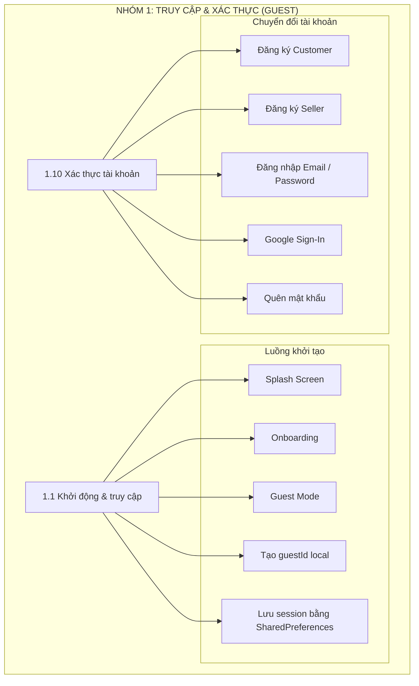
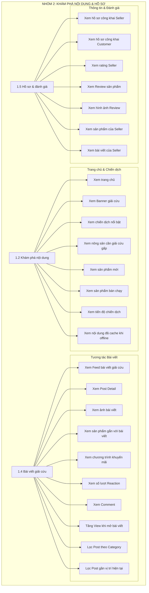
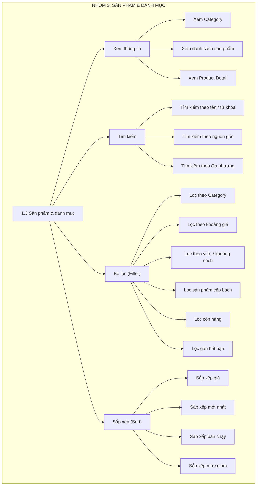
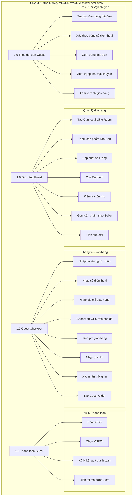

### 1. Truy cập và Xác thực

```mermaid
flowchart LR
    subgraph AUTH["NHÓM 1: TRUY CẬP & XÁC THỰC (GUEST)"]
        direction LR

        G1["1.1 Khởi động & truy cập"]
        G10["1.10 Xác thực tài khoản"]

        subgraph G1_SUB["Luồng khởi tạo"]
            direction TB
            G11["Splash Screen"]
            G12["Onboarding"]
            G13["Guest Mode"]
            G14["Tạo guestId local"]
            G15["Lưu session bằng SharedPreferences"]
        end

        subgraph G10_SUB["Chuyển đổi tài khoản"]
            direction TB
            G101["Đăng ký Customer"]
            G102["Đăng ký Seller"]
            G103["Đăng nhập Email / Password"]
            G104["Google Sign-In"]
            G105["Quên mật khẩu"]
        end

        G1 --> G11 & G12 & G13 & G14 & G15
        G10 --> G101 & G102 & G103 & G104 & G105
    end
```

### 2. Khám phá nội dung và Hồ sơ

```mermaid
flowchart LR
    subgraph DISCOVERY["NHÓM 2: KHÁM PHÁ NỘI DUNG & HỒ SƠ"]
        direction LR

        G2["1.2 Khám phá nội dung"]
        G4["1.4 Bài viết giải cứu"]
        G5["1.5 Hồ sơ & đánh giá"]

        subgraph G2_SUB["Trang chủ & Chiến dịch"]
            direction TB
            G21["Xem trang chủ"]
            G22["Xem Banner giải cứu"]
            G23["Xem chiến dịch nổi bật"]
            G24["Xem nông sản cần giải cứu gấp"]
            G25["Xem sản phẩm mới"]
            G26["Xem sản phẩm bán chạy"]
            G27["Xem tiến độ chiến dịch"]
            G28["Xem nội dung đã cache khi offline"]
        end

        subgraph G4_SUB["Tương tác Bài viết"]
            direction TB
            G41["Xem Feed bài viết giải cứu"]
            G42["Xem Post Detail"]
            G43["Xem ảnh bài viết"]
            G44["Xem sản phẩm gắn với bài viết"]
            G45["Xem chương trình khuyến mãi"]
            G46["Xem số lượt Reaction"]
            G47["Xem Comment"]
            G48["Tăng View khi mở bài viết"]
            G49["Lọc Post theo Category"]
            G410["Lọc Post gần vị trí hiện tại"]
        end

        subgraph G5_SUB["Thông tin & Đánh giá"]
            direction TB
            G51["Xem hồ sơ công khai Seller"]
            G52["Xem hồ sơ công khai Customer"]
            G53["Xem rating Seller"]
            G54["Xem Review sản phẩm"]
            G55["Xem hình ảnh Review"]
            G56["Xem sản phẩm của Seller"]
            G57["Xem bài viết của Seller"]
        end

        G2 --> G21 & G22 & G23 & G24 & G25 & G26 & G27 & G28
        G4 --> G41 & G42 & G43 & G44 & G45 & G46 & G47 & G48 & G49 & G410
        G5 --> G51 & G52 & G53 & G54 & G55 & G56 & G57
    end
```

### 3. Sản phẩm và Danh mục

```mermaid
flowchart LR
    subgraph CATALOG["NHÓM 3: SẢN PHẨM & DANH MỤC"]
        direction LR

        G3["1.3 Sản phẩm & danh mục"]

        G3_VIEW["Xem thông tin"]
        G3_SEARCH["Tìm kiếm"]
        G3_FILTER["Bộ lọc (Filter)"]
        G3_SORT["Sắp xếp (Sort)"]

        G3 --> G3_VIEW & G3_SEARCH & G3_FILTER & G3_SORT

        G3_VIEW --> G31["Xem Category"]
        G3_VIEW --> G32["Xem danh sách sản phẩm"]
        G3_VIEW --> G33["Xem Product Detail"]

        G3_SEARCH --> G34["Tìm kiếm theo tên / từ khóa"]
        G3_SEARCH --> G35["Tìm kiếm theo nguồn gốc"]
        G3_SEARCH --> G36["Tìm kiếm theo địa phương"]

        G3_FILTER --> G37["Lọc theo Category"]
        G3_FILTER --> G38["Lọc theo khoảng giá"]
        G3_FILTER --> G39["Lọc theo vị trí / khoảng cách"]
        G3_FILTER --> G310["Lọc sản phẩm cấp bách"]
        G3_FILTER --> G311["Lọc còn hàng"]
        G3_FILTER --> G312["Lọc gần hết hạn"]

        G3_SORT --> G313["Sắp xếp giá"]
        G3_SORT --> G314["Sắp xếp mới nhất"]
        G3_SORT --> G315["Sắp xếp bán chạy"]
        G3_SORT --> G316["Sắp xếp mức giảm"]
    end
```

### 4. Giỏ hàng, Thanh toán và Theo dõi đơn

```mermaid
flowchart LR
    subgraph ORDER_FLOW["NHÓM 4: GIỎ HÀNG, THANH TOÁN & THEO DÕI ĐƠN"]
        direction LR

        G6["1.6 Giỏ hàng Guest"]
        G7["1.7 Guest Checkout"]
        G8["1.8 Thanh toán Guest"]
        G9["1.9 Theo dõi đơn Guest"]

        subgraph G6_SUB["Quản lý Giỏ hàng"]
            direction TB
            G61["Tạo Cart local bằng Room"]
            G62["Thêm sản phẩm vào Cart"]
            G63["Cập nhật số lượng"]
            G64["Xóa CartItem"]
            G65["Kiểm tra tồn kho"]
            G66["Gom sản phẩm theo Seller"]
            G67["Tính subtotal"]
        end

        subgraph G7_SUB["Thông tin Giao hàng"]
            direction TB
            G71["Nhập họ tên người nhận"]
            G72["Nhập số điện thoại"]
            G73["Nhập địa chỉ giao hàng"]
            G74["Chọn vị trí GPS trên bản đồ"]
            G75["Tính phí giao hàng"]
            G76["Nhập ghi chú"]
            G77["Xác nhận thông tin"]
            G78["Tạo Guest Order"]
        end

        subgraph G8_SUB["Xử lý Thanh toán"]
            direction TB
            G81["Chọn COD"]
            G82["Chọn VNPAY"]
            G83["Xử lý kết quả thanh toán"]
            G84["Hiển thị mã đơn Guest"]
        end

        subgraph G9_SUB["Tra cứu & Vận chuyển"]
            direction TB
            G91["Tra cứu đơn bằng mã đơn"]
            G92["Xác thực bằng số điện thoại"]
            G93["Xem trạng thái đơn"]
            G94["Xem trạng thái vận chuyển"]
            G95["Xem lộ trình giao hàng"]
        end

        G6 --> G61 & G62 & G63 & G64 & G65 & G66 & G67
        G7 --> G71 & G72 & G73 & G74 & G75 & G76 & G77 & G78
        G8 --> G81 & G82 & G83 & G84
        G9 --> G91 & G92 & G93 & G94 & G95
    end
```
