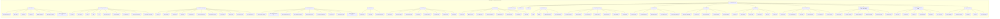

```mermaid
flowchart TB
    subgraph CUSTOMER["2. CUSTOMER - NGƯỜI MUA / NGUỒN CẦU"]
        direction TB

        C1["2.1 Tài khoản & hồ sơ"]
        C2["2.2 Sổ địa chỉ"]
        C3["2.3 Khám phá sản phẩm"]
        C4["2.4 Bài viết & cộng đồng"]
        C5["2.5 Chiến dịch giải cứu"]
        C6["2.6 Yêu thích"]
        C7["2.7 Giỏ hàng"]
        C8["2.8 Checkout"]
        C9["2.9 Thanh toán"]
        C10["2.10 Quản lý đơn hàng"]
        C11["2.11 Vận chuyển"]
        C12["2.12 Đánh giá"]
        C13["2.13 Báo cáo vi phạm"]
        C14["2.14 Lịch sử giao dịch"]
        C15["2.15 Thông báo"]
        C16["2.16 Offline"]
        C17["2.17 Xem hồ sơ cộng đồng"]

        C1 --> C11["Xem Profile"]
        C1 --> C12["Sửa họ tên"]
        C1 --> C13["Sửa avatar"]
        C1 --> C14["Sửa số điện thoại"]
        C1 --> C15["Cập nhật loại Customer cá nhân / doanh nghiệp"]
        C1 --> C16["Cập nhật thông tin doanh nghiệp"]
        C1 --> C17["Lấy GPS hiện tại"]
        C1 --> C18["Reverse Geocoding"]
        C1 --> C19["Đổi mật khẩu"]
        C1 --> C110["Đăng xuất"]

        C2 --> C21["Xem danh sách địa chỉ"]
        C2 --> C22["Thêm địa chỉ"]
        C2 --> C23["Sửa địa chỉ"]
        C2 --> C24["Xóa địa chỉ"]
        C2 --> C25["Đặt địa chỉ mặc định"]
        C2 --> C26["Gắn Latitude / Longitude"]
        C2 --> C27["Chọn vị trí bằng Google Maps"]

        C3 --> C31["Xem Home"]
        C3 --> C32["Xem Category"]
        C3 --> C33["Search"]
        C3 --> C34["Filter"]
        C3 --> C35["Sort"]
        C3 --> C36["Xem Product Detail"]
        C3 --> C37["Xem ProductBatch"]
        C3 --> C38["Xem hạn sử dụng"]
        C3 --> C39["Xem giá gốc / giá giải cứu"]
        C3 --> C310["Xem khoảng cách tới Seller"]

        C4 --> C41["Xem Feed"]
        C4 --> C42["Xem Post Detail"]
        C4 --> C43["React bài viết"]
        C4 --> C44["Bỏ Reaction"]
        C4 --> C45["Comment bài viết"]
        C4 --> C46["Sửa Comment của mình"]
        C4 --> C47["Xóa Comment của mình"]
        C4 --> C48["Xem Comment"]
        C4 --> C49["Xem lượt View"]
        C4 --> C410["Mở Product từ Post"]
        C4 --> C411["Mở Campaign từ Post"]

        C5 --> C51["Xem danh sách Campaign"]
        C5 --> C52["Xem Campaign đang hoạt động"]
        C5 --> C53["Xem Campaign gần hết hạn"]
        C5 --> C54["Xem Campaign hoàn thành"]
        C5 --> C55["Xem mục tiêu sản lượng"]
        C5 --> C56["Xem sản lượng đã giải cứu"]
        C5 --> C57["Xem % tiến độ"]
        C5 --> C58["Xem thời gian còn lại"]
        C5 --> C59["Mua sản phẩm trong Campaign"]

        C6 --> C61["Thêm Favorite"]
        C6 --> C62["Bỏ Favorite"]
        C6 --> C63["Xem danh sách Favorite"]

        C7 --> C71["Thêm CartItem"]
        C7 --> C72["Chọn ProductBatch"]
        C7 --> C73["Tăng / giảm số lượng"]
        C7 --> C74["Xóa CartItem"]
        C7 --> C75["Chọn item Checkout"]
        C7 --> C76["Gom theo Seller"]
        C7 --> C77["Validate tồn kho"]
        C7 --> C78["Tính subtotal"]

        C8 --> C81["Chọn địa chỉ"]
        C8 --> C82["Áp dụng Voucher"]
        C8 --> C83["Tính Shipping Fee"]
        C8 --> C84["Chọn Payment Method"]
        C8 --> C85["Nhập Order Note"]
        C8 --> C86["Kiểm tra lại tồn kho"]
        C8 --> C87["Tính tổng tiền"]
        C8 --> C88["Place Order"]

        C9 --> C91["COD"]
        C9 --> C92["VNPAY"]
        C9 --> C93["Nhận Payment Result"]
        C9 --> C94["Xem Payment Status"]

        C10 --> C101["Xem danh sách Order"]
        C10 --> C102["Xem Order Detail"]
        C10 --> C103["Lọc theo trạng thái"]
        C10 --> C104["Theo dõi Timeline"]
        C10 --> C105["Hủy đơn khi hợp lệ"]
        C10 --> C106["Xem SellerOrder"]
        C10 --> C107["Xem OrderItem"]

        C11 --> C111["Xem mã vận đơn"]
        C11 --> C112["Xem Shipment Status"]
        C11 --> C113["Xem điểm xuất phát"]
        C11 --> C114["Xem điểm giao hàng"]
        C11 --> C115["Xem bản đồ Google Maps"]

        C12 --> C121["Đánh giá sau DELIVERED"]
        C12 --> C122["Rating 1-5 sao"]
        C12 --> C123["Viết nội dung Review"]
        C12 --> C124["Upload ảnh Review"]
        C12 --> C125["Xem Review đã gửi"]

        C13 --> C131["Report Post"]
        C13 --> C132["Report Product"]
        C13 --> C133["Report Seller"]
        C13 --> C134["Report Review"]
        C13 --> C135["Chọn lý do"]
        C13 --> C136["Nhập mô tả"]

        C14 --> C141["Xem giao dịch"]
        C14 --> C142["Xem Payment Method"]
        C14 --> C143["Xem số tiền"]
        C14 --> C144["Xem Transaction ID"]
        C14 --> C145["Lọc theo thời gian"]
        C14 --> C146["Lọc theo trạng thái"]

        C15 --> C151["Thông báo Order"]
        C15 --> C152["Thông báo Payment"]
        C15 --> C153["Thông báo Shipment"]
        C15 --> C154["Thông báo Campaign"]
        C15 --> C155["Thông báo tương tác"]
        C15 --> C156["Đánh dấu đã đọc"]

        C16 --> C161["Cache Home"]
        C16 --> C162["Cache Product"]
        C16 --> C163["Cache Post"]
        C16 --> C164["Cache Campaign"]
        C16 --> C165["Cache Order"]
        C16 --> C166["Sync khi có mạng"]

        C17 --> C171["Xem Profile Seller"]
        C17 --> C172["Xem Profile Customer"]
        C17 --> C173["Xem Rating"]
        C17 --> C174["Xem Post"]
        C17 --> C175["Xem Product Seller"]
    end
```
