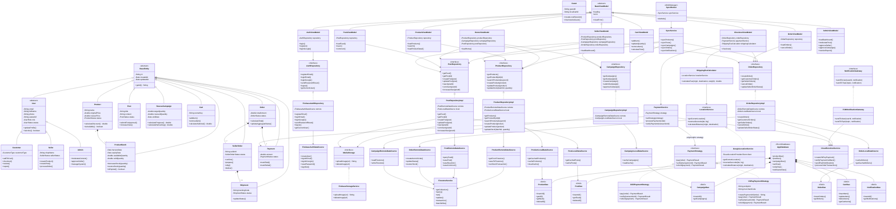

```mermaid
classDiagram

%% =========================================================
%% CORE ABSTRACTION
%% =========================================================

class BaseEntity {
    <<abstract>>
    -String id
    -Date createdAt
    -Date updatedAt
    +getId() String
}

class User {
    <<abstract>>
    -String email
    -String fullName
    -String phone
    -String avatarUrl
    -UserRole role
    -UserStatus status
    +updateProfile()
    +isActive() boolean
}

class Guest {
    -String guestId
    -String localCartId
    +createLocalSession()
    +checkoutAsGuest()
}

class Customer {
    -CustomerType customerType
    +addToCart()
    +checkout()
    +review()
    +report()
}

class Seller {
    -String shopName
    -SellerStatus sellerStatus
    +createProduct()
    +createPost()
    +processOrder()
}

class Admin {
    +moderateContent()
    +approveSeller()
    +manageSystem()
}

BaseEntity <|-- User
User <|-- Customer
User <|-- Seller
User <|-- Admin

%% Guest intentionally does not inherit User

%% =========================================================
%% DOMAIN ENTITIES
%% =========================================================

class Product {
    -String name
    -double originalPrice
    -double rescuePrice
    -ProductStatus status
    +calculateDiscount() double
    +isAvailable() boolean
}

class ProductBatch {
    -Date harvestDate
    -Date expiryDate
    -double availableQuantity
    -double soldQuantity
    +decreaseStock(quantity)
    +restoreStock(quantity)
    +isExpired() boolean
}

class Post {
    -String title
    -String content
    -PostStatus status
    +submitForApproval()
    +increaseView()
}

class RescueCampaign {
    -double targetQuantity
    -double rescuedQuantity
    -Date endDate
    +calculateProgress() double
    +calculateRemaining() double
}

class Cart {
    -String ownerKey
    +addItem()
    +removeItem()
    +calculateSubtotal() double
}

class Order {
    -double totalAmount
    -OrderStatus status
    +calculateTotal()
    +updateAggregateStatus()
}

class SellerOrder {
    -String sellerId
    -SellerOrderStatus status
    +confirm()
    +prepare()
    +ship()
    +deliver()
}

class Payment {
    -double amount
    -PaymentStatus status
    +markPaid()
    +markFailed()
}

class Shipment {
    -String trackingCode
    -ShipmentStatus status
    +updateStatus()
}

BaseEntity <|-- Product
BaseEntity <|-- ProductBatch
BaseEntity <|-- Post
BaseEntity <|-- RescueCampaign
BaseEntity <|-- Cart
BaseEntity <|-- Order
BaseEntity <|-- SellerOrder
BaseEntity <|-- Payment
BaseEntity <|-- Shipment

Product "1" *-- "1..*" ProductBatch
Order "1" *-- "1..*" SellerOrder
SellerOrder "1" *-- "0..1" Shipment
Order "1" *-- "1" Payment

%% =========================================================
%% PAYMENT POLYMORPHISM
%% =========================================================

class PaymentStrategy {
    <<interface>>
    +pay(order) PaymentResult
    +verify(transactionId) PaymentResult
    +refund(payment) PaymentResult
}

class CODPaymentStrategy {
    +pay(order) PaymentResult
    +verify(transactionId) PaymentResult
    +refund(payment) PaymentResult
}

class VNPayPaymentStrategy {
    -String endpoint
    -String merchantCode
    +createPaymentUrl(order) String
    +pay(order) PaymentResult
    +verify(transactionId) PaymentResult
    +refund(payment) PaymentResult
}

PaymentStrategy <|.. CODPaymentStrategy
PaymentStrategy <|.. VNPayPaymentStrategy

class PaymentService {
    -PaymentStrategy strategy
    +setStrategy(strategy)
    +processPayment(order)
    +verifyPayment(transactionId)
}

PaymentService --> PaymentStrategy : polymorphic strategy
PaymentService --> Payment

%% =========================================================
%% AUTH ABSTRACTION
%% =========================================================

class AuthRepository {
    <<interface>>
    +registerEmail()
    +loginEmail()
    +loginGoogle()
    +sendPasswordReset()
    +logout()
    +getCurrentUser()
}

class FirebaseAuthRepository {
    -FirebaseAuthDataSource remote
    +registerEmail()
    +loginEmail()
    +loginGoogle()
    +sendPasswordReset()
    +logout()
    +getCurrentUser()
}

AuthRepository <|.. FirebaseAuthRepository

class FirebaseAuthDataSource {
    +createUser()
    +signInEmail()
    +signInGoogle()
    +resetPassword()
    +signOut()
}

FirebaseAuthRepository --> FirebaseAuthDataSource

%% =========================================================
%% PRODUCT REPOSITORY
%% =========================================================

class ProductRepository {
    <<interface>>
    +getProducts()
    +getProductById(id)
    +searchProducts(keyword)
    +createProduct(product)
    +updateProduct(product)
    +updateStock(batchId, quantity)
}

class ProductRepositoryImpl {
    -ProductRemoteDataSource remote
    -ProductLocalDataSource local
    +getProducts()
    +getProductById(id)
    +searchProducts(keyword)
    +createProduct(product)
    +updateProduct(product)
    +updateStock(batchId, quantity)
}

ProductRepository <|.. ProductRepositoryImpl

class ProductRemoteDataSource {
    +getFromFirestore()
    +saveToFirestore()
    +runStockTransaction()
}

class ProductLocalDataSource {
    +getCachedProducts()
    +cacheProducts()
    +clearCache()
}

ProductRepositoryImpl --> ProductRemoteDataSource
ProductRepositoryImpl --> ProductLocalDataSource

%% =========================================================
%% POST / COMMUNITY REPOSITORY
%% =========================================================

class PostRepository {
    <<interface>>
    +getFeed()
    +getPost(id)
    +createPost(post)
    +updatePost(post)
    +react(postId)
    +comment(postId)
    +increaseView(postId)
}

class PostRepositoryImpl {
    -PostRemoteDataSource remote
    -PostLocalDataSource local
    +getFeed()
    +getPost(id)
    +createPost(post)
    +updatePost(post)
    +react(postId)
    +comment(postId)
    +increaseView(postId)
}

PostRepository <|.. PostRepositoryImpl

class PostRemoteDataSource {
    +queryFeed()
    +savePost()
    +saveReaction()
    +saveComment()
}

class PostLocalDataSource {
    +getCachedPosts()
    +cachePosts()
}

PostRepositoryImpl --> PostRemoteDataSource
PostRepositoryImpl --> PostLocalDataSource

%% =========================================================
%% ORDER REPOSITORY
%% =========================================================

class OrderRepository {
    <<interface>>
    +createOrder()
    +getCustomerOrders()
    +getSellerOrders()
    +cancelOrder()
    +updateSellerOrderStatus()
}

class OrderRepositoryImpl {
    -OrderRemoteDataSource remote
    -OrderLocalDataSource local
    +createOrder()
    +getCustomerOrders()
    +getSellerOrders()
    +cancelOrder()
    +updateSellerOrderStatus()
}

OrderRepository <|.. OrderRepositoryImpl

class OrderRemoteDataSource {
    +createAtomicOrder()
    +updateStatus()
    +restoreStock()
}

class OrderLocalDataSource {
    +cacheOrders()
    +getCachedOrders()
}

OrderRepositoryImpl --> OrderRemoteDataSource
OrderRepositoryImpl --> OrderLocalDataSource

%% =========================================================
%% CAMPAIGN REPOSITORY
%% =========================================================

class CampaignRepository {
    <<interface>>
    +getCampaigns()
    +getCampaign(id)
    +createCampaign()
    +submitCampaign()
    +approveCampaign()
}

class CampaignRepositoryImpl {
    -CampaignRemoteDataSource remote
    -CampaignLocalDataSource local
}

CampaignRepository <|.. CampaignRepositoryImpl

class CampaignRemoteDataSource {
    +readFirestore()
    +writeFirestore()
}

class CampaignLocalDataSource {
    +cacheCampaigns()
    +readCache()
}

CampaignRepositoryImpl --> CampaignRemoteDataSource
CampaignRepositoryImpl --> CampaignLocalDataSource

%% =========================================================
%% STORAGE ABSTRACTION
%% =========================================================

class MediaStorage {
    <<interface>>
    +uploadImage(uri) String
    +deleteImage(url)
}

class FirebaseStorageService {
    +uploadImage(uri) String
    +deleteImage(url)
}

MediaStorage <|.. FirebaseStorageService

ProductRepositoryImpl --> MediaStorage
PostRepositoryImpl --> MediaStorage

%% =========================================================
%% LOCATION / GPS ABSTRACTION
%% =========================================================

class LocationService {
    <<interface>>
    +getCurrentLocation()
    +reverseGeocode(lat, lng)
    +calculateDistance(origin, destination)
}

class GoogleLocationService {
    -FusedLocationProviderClient client
    +getCurrentLocation()
    +reverseGeocode(lat, lng)
    +calculateDistance(origin, destination)
}

LocationService <|.. GoogleLocationService

class ShippingFeeCalculator {
    -LocationService locationService
    +calculateFee(origin, destination, weight) double
}

ShippingFeeCalculator --> LocationService

%% =========================================================
%% NOTIFICATION ABSTRACTION
%% =========================================================

class NotificationGateway {
    <<interface>>
    +sendToUser(userId, notification)
    +sendToTopic(topic, notification)
}

class FCMNotificationGateway {
    +sendToUser(userId, notification)
    +sendToTopic(topic, notification)
}

NotificationGateway <|.. FCMNotificationGateway

%% =========================================================
%% LOCAL DATABASE
%% =========================================================

class AppDatabase {
    <<RoomDatabase>>
    +productDao()
    +postDao()
    +campaignDao()
    +cartDao()
    +orderDao()
    +notificationDao()
}

class ProductDao {
    <<DAO>>
    +insertAll()
    +getAll()
    +getById()
    +deleteAll()
}

class PostDao {
    <<DAO>>
    +insertAll()
    +getFeed()
    +deleteAll()
}

class CampaignDao {
    <<DAO>>
    +insertAll()
    +getCampaigns()
}

class CartDao {
    <<DAO>>
    +insertItem()
    +updateItem()
    +deleteItem()
    +getCartItems()
}

class OrderDao {
    <<DAO>>
    +insertOrders()
    +getOrders()
}

class NotificationDao {
    <<DAO>>
    +insertAll()
    +getNotifications()
}

AppDatabase *-- ProductDao
AppDatabase *-- PostDao
AppDatabase *-- CampaignDao
AppDatabase *-- CartDao
AppDatabase *-- OrderDao
AppDatabase *-- NotificationDao

ProductLocalDataSource --> ProductDao
PostLocalDataSource --> PostDao
CampaignLocalDataSource --> CampaignDao
OrderLocalDataSource --> OrderDao

%% =========================================================
%% FIREBASE / REMOTE INFRASTRUCTURE
%% =========================================================

class FirestoreService {
    +getCollection()
    +query()
    +set()
    +update()
    +transaction()
    +batchWrite()
}

class CloudFunctionService {
    +createVNPayPayment()
    +verifyPaymentCallback()
    +sendPushNotification()
    +processOrderTransaction()
}

ProductRemoteDataSource --> FirestoreService
PostRemoteDataSource --> FirestoreService
OrderRemoteDataSource --> FirestoreService
CampaignRemoteDataSource --> FirestoreService

OrderRepositoryImpl --> CloudFunctionService
PaymentService --> CloudFunctionService
FCMNotificationGateway --> CloudFunctionService

%% =========================================================
%% SYNC / OFFLINE
%% =========================================================

class SyncService {
    +syncProducts()
    +syncPosts()
    +syncCampaigns()
    +syncOrders()
    +syncNotifications()
}

class SyncWorker {
    <<WorkManager>>
    -SyncService syncService
    +doWork()
}

SyncWorker --> SyncService

SyncService --> ProductRepository
SyncService --> PostRepository
SyncService --> CampaignRepository
SyncService --> OrderRepository

%% =========================================================
%% VIEWMODEL LAYER
%% =========================================================

class BaseViewModel {
    <<abstract>>
    +loading
    +error
    +clearError()
}

class AuthViewModel {
    -AuthRepository repository
    +login()
    +register()
    +loginGoogle()
}

class HomeViewModel {
    -ProductRepository productRepository
    -CampaignRepository campaignRepository
    -PostRepository postRepository
    +loadHome()
}

class ProductViewModel {
    -ProductRepository repository
    +loadProducts()
    +search()
    +loadProductDetail()
}

class PostViewModel {
    -PostRepository repository
    +loadFeed()
    +react()
    +comment()
}

class CartViewModel {
    +addItem()
    +updateQuantity()
    +removeItem()
    +calculateTotal()
}

class CheckoutViewModel {
    -OrderRepository orderRepository
    -PaymentService paymentService
    -ShippingFeeCalculator shippingCalculator
    +checkout()
}

class OrderViewModel {
    -OrderRepository repository
    +loadOrders()
    +cancelOrder()
}

class SellerViewModel {
    -ProductRepository productRepository
    -PostRepository postRepository
    -CampaignRepository campaignRepository
    -OrderRepository orderRepository
    +loadDashboard()
}

class AdminViewModel {
    +loadDashboard()
    +moderatePost()
    +approveSeller()
    +approveCampaign()
    +resolveReport()
}

BaseViewModel <|-- AuthViewModel
BaseViewModel <|-- HomeViewModel
BaseViewModel <|-- ProductViewModel
BaseViewModel <|-- PostViewModel
BaseViewModel <|-- CartViewModel
BaseViewModel <|-- CheckoutViewModel
BaseViewModel <|-- OrderViewModel
BaseViewModel <|-- SellerViewModel
BaseViewModel <|-- AdminViewModel

AuthViewModel --> AuthRepository
HomeViewModel --> ProductRepository
HomeViewModel --> CampaignRepository
HomeViewModel --> PostRepository
ProductViewModel --> ProductRepository
PostViewModel --> PostRepository
CheckoutViewModel --> OrderRepository
CheckoutViewModel --> PaymentService
CheckoutViewModel --> ShippingFeeCalculator
OrderViewModel --> OrderRepository
SellerViewModel --> ProductRepository
SellerViewModel --> PostRepository
SellerViewModel --> CampaignRepository
SellerViewModel --> OrderRepository
```
